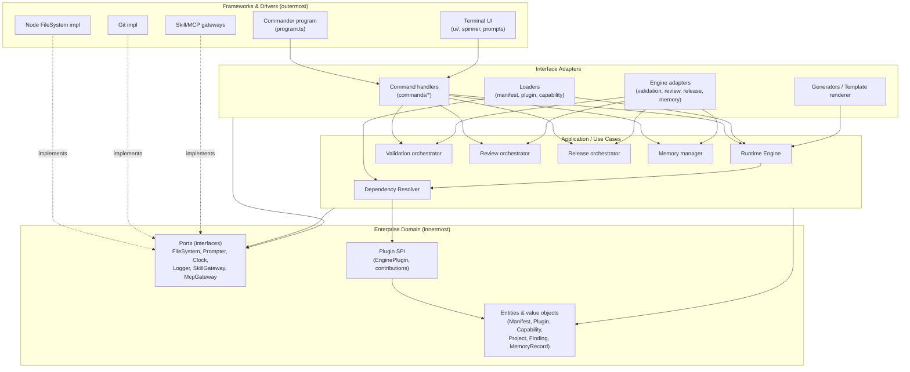
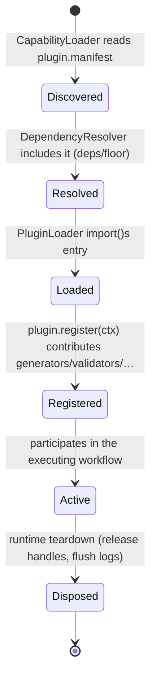
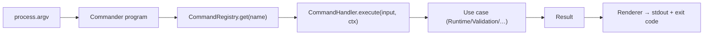
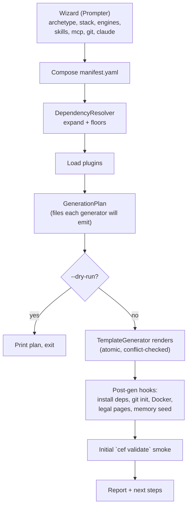
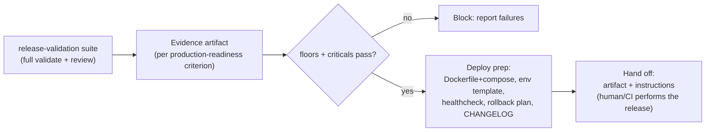
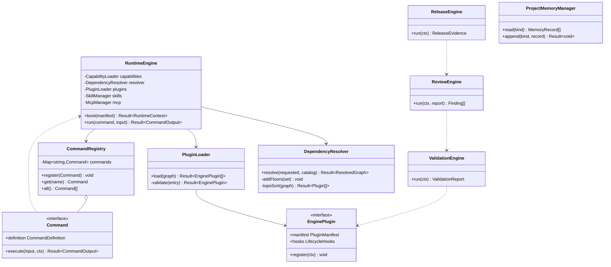
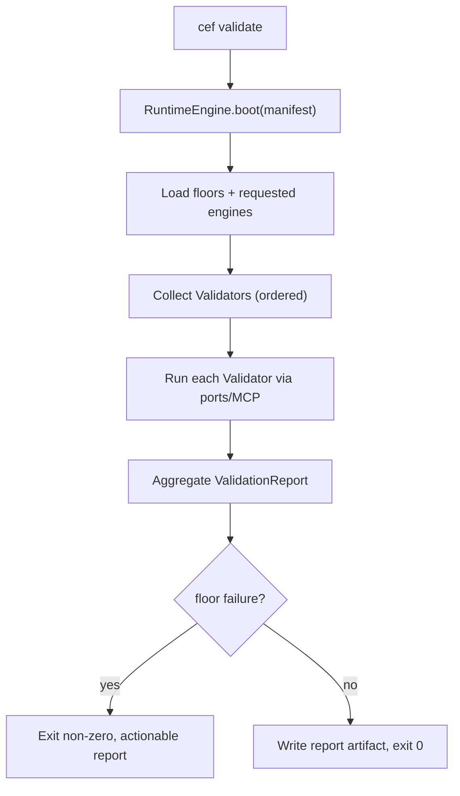
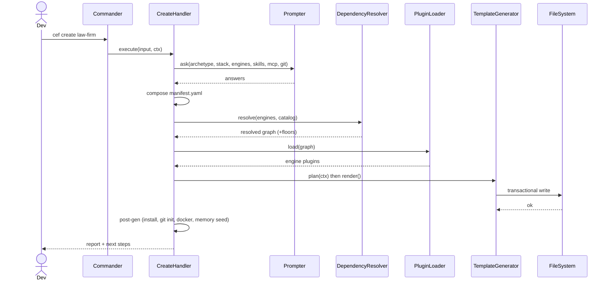
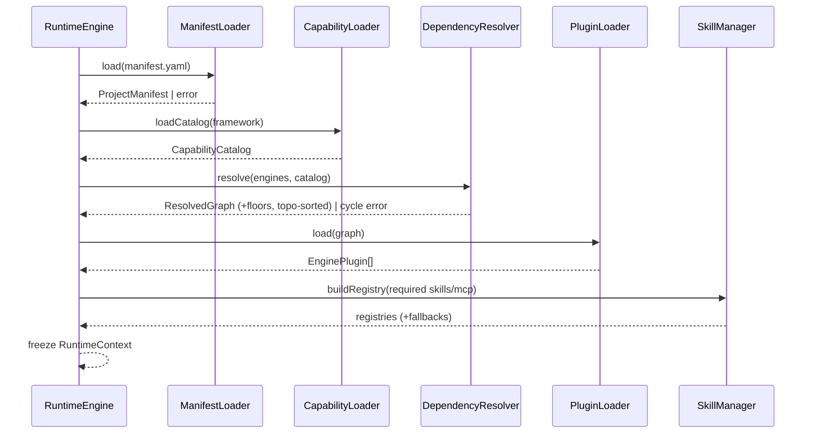

# CEF CLI & Runtime — Software Architecture

**Product:** `cef` — the Claude Enterprise Framework command-line application
**Document:** Software Architecture Specification (SAS-001)
**Version:** 0.1.0 · **Status:** For Approval
**Scope:** Design only. No implementation until this document is approved.

> The architecture specifications **AS-000 … AS-020** are the source of truth for *what the framework knows*. This document designs the *software that runs it*. It never redesigns, rewrites, or simplifies the specs; it loads them as data.

---

## 0. How to read this document

This is the Planning deliverable required before any code is written. It covers all twenty requested architecture artifacts. Each is a numbered section:

| # | Artifact | § |
|---|---|---|
| 1 | Folder structure | §3 |
| 2 | Package architecture | §4 |
| 3 | Dependency graph | §5 |
| 4 | Configuration architecture | §6 |
| 5 | Framework loading pipeline | §7 |
| 6 | Plugin architecture | §8 |
| 7 | Plugin interfaces / Extension APIs | §8.4, §18 |
| 8 | Runtime architecture | §9 |
| 9 | CLI command architecture | §10 |
| 10 | Project generation pipeline | §11 |
| 11 | Memory architecture | §12 |
| 12 | Validation architecture | §13 |
| 13 | Review architecture | §14 |
| 14 | Deployment architecture | §15 |
| 15 | Class diagrams | §16 |
| 16 | Execution flow diagrams | §17.1 |
| 17 | Sequence diagrams | §17.2 |
| 18 | Data models | §18 |
| 19 | Configuration schemas | §6.3 |
| 20 | Extension APIs | §8.4, §18.5 |

Plus: services responsibility matrix (§9.4), error/logging/DI (§19), testing strategy (§20), and the **milestone roadmap** (§21) that governs implementation order.

---

## 1. Goals and non-goals

### Goals

- A production-grade, globally installable CLI (`npm i -g @cef/cli` → `cef`) that scaffolds, configures, validates, reviews, and prepares enterprise websites for release.
- The CLI is the **Runtime** of the framework: it reads a project manifest, resolves and loads only the engines that project needs, and orchestrates the CEF lifecycle.
- **Zero hardcoded framework knowledge.** Engines, standards, policies, skills, and MCP requirements are discovered and loaded dynamically from framework metadata.
- A real **plugin architecture**: every engine (AS-001 … AS-020) is an independent, self-describing plugin with declared dependencies, contributions, and lifecycle.
- Clean Architecture, SOLID, dependency injection, high cohesion, low coupling, high testability.

### Non-goals (for the CLI itself)

- The CLI does not *contain* the standards/policies prose — that lives in `@cef/framework` and is loaded as data.
- The CLI does not execute Claude or skills itself; it **orchestrates** them (produces prompts, routes to skills/MCP per the Runtime Engine and Tool Engine rules, records results). Skill/MCP invocation contracts are defined by the framework (AS-007 Decision Engine, `tool-engine`, `runtime/skill-manager`).
- The CLI is not a CI server; it produces the pipelines and evidence the AS-020 Validation & Automation Engine specifies, to run under any CI provider.

---

## 2. Key architectural decisions

Decisions marked **(confirmed)** were approved before this draft. The rest are recommendations for sign-off (§22).

- **KD-1 — Monorepo, pnpm workspaces. (confirmed)** One repository with independently publishable packages. Atomic cross-package changes, shared toolchain, `changesets` for versioning.
- **KD-2 — Commander.js at the edge + custom Runtime and DI. (confirmed)** Commander is a thin adapter in the outermost layer. All behavior lives in framework-agnostic handler/use-case classes wired by a DI container. The CLI framework is swappable; nothing in the core depends on it. oclif was rejected: its static command classes and singleton model fight constructor DI, and its npm-package plugin concept collides with CEF engine-plugins.
- **KD-3 — TypeScript, Node ≥ 20, ESM-only, `strict`.** `module: NodeNext`. Type-check with `tsc`; bundle the bin with `tsup` (esbuild); emit declarations for libraries. This satisfies the framework's own TypeScript standard (Principle 25).
- **KD-4 — Dynamic framework loading.** The CLI depends on framework *interfaces*, never framework *content*. All engine/standard/policy/skill/MCP data is read at runtime from `@cef/framework` via manifests. Adding an engine to the framework requires **no CLI code change**.
- **KD-5 — Engine = plugin.** Each AS engine maps to a plugin exposing an `EnginePlugin` contract via a `plugin.manifest.yaml` + entry module. The Runtime resolves the dependency graph and loads only what the project requires plus the mandatory floors.
- **KD-6 — Minimal, explicit DI container.** A small token-based container (constructor injection, factory registration) rather than a decorator/`reflect-metadata` framework. Keeps dependencies minimal (Principle 18) and tests trivial — every collaborator is an interface with a fake.
- **KD-7 — `zod` as the single validation/schema authority.** Every config and manifest is parsed through a `zod` schema; JSON Schema is generated from it for editor support. One source of truth per shape (mirrors the framework's single-source-of-truth rule).
- **KD-8 — `vitest` for tests, `eslint`+`prettier` for static analysis.** Fast, ESM-native, matches AS-020's build-validation base (`BLD-01…BLD-03`).
- **KD-9 — Result-typed error handling.** Domain operations return `Result<T, CefError>`; only the Commander adapter converts errors to exit codes and formatted output. No throwing across layer boundaries for expected failures.

---

## 3. Folder structure

### 3.1 Monorepo root

```
cef/                                  # repo root (currently F:\Klivo\CEF)
├─ packages/
│  ├─ cli/                            # @cef/cli — the installable binary
│  ├─ core/                           # @cef/core — runtime, plugin SDK, types (no CLI deps)
│  ├─ framework/                      # @cef/framework — the AS-000…020 content as data
│  ├─ plugins/                        # @cef/plugin-* — one package per engine
│  │  ├─ core/                        #   floors + constitution + rule engine
│  │  ├─ platform/                    #   AS: platform/next/react/ts/tailwind
│  │  ├─ architecture/
│  │  ├─ design/  experience/  components/  motion/
│  │  ├─ seo/  ai-seo/
│  │  ├─ security/  performance/  accessibility/  legal/
│  │  ├─ testing/  docker/  deployment/
│  │  ├─ commerce/  content/  ai/
│  │  └─ validation/                  #   AS-020
│  └─ testing/                        # @cef/testing — shared test doubles & harness
├─ examples/                          # generated sample projects (fixtures for e2e)
├─ docs/                              # developer/API/architecture/plugin guides
├─ .changeset/                        # release notes per package
├─ pnpm-workspace.yaml
├─ tsconfig.base.json
├─ package.json                       # root: scripts, devDeps, workspaces
├─ ARCHITECTURE.md                    # this document
├─ README.md
└─ LICENSE
```

### 3.2 `@cef/cli` internals (maps the requested `cef-cli/` tree)

```
packages/cli/
├─ src/
│  ├─ bin/cef.ts                      # #!/usr/bin/env node — ESM entrypoint, boots container
│  ├─ program.ts                      # builds the Commander program from the CommandRegistry
│  ├─ commands/                       # one module per command (Command Pattern, §10)
│  │  ├─ create/  init/  add/  remove/  doctor/  validate/  review/
│  │  ├─ memory/  update/  release/  deploy/  audit/  optimize/
│  │  └─ plugins/  capabilities/  upgrade/  info/
│  ├─ runtime/                        # thin re-export/wiring of @cef/core runtime for CLI use
│  ├─ framework/                      # framework locator (resolves @cef/framework on disk)
│  ├─ capabilities/                   # capability presentation (list/inspect) adapters
│  ├─ templates/                      # CLI-owned scaffolds not belonging to an engine
│  ├─ generators/                     # project generators orchestrated by `create`
│  ├─ services/                       # CLI-scoped services (prompter, spinner, fs, git)
│  ├─ memory/                         # ProjectMemoryManager adapter
│  ├─ policies/                       # policy loader adapter
│  ├─ review/                         # ReviewEngine adapter
│  ├─ validation/                     # ValidationEngine adapter
│  ├─ deployment/                     # ReleaseEngine / Docker generator adapters
│  ├─ ui/                             # terminal rendering: tables, trees, diff, prompts
│  ├─ utils/                          # pure helpers (paths, semver, yaml, result)
│  ├─ config/                         # config resolution + zod schemas
│  ├─ di/                             # container composition root (registers everything)
│  └─ types/                          # CLI-only types (re-exports @cef/core types)
├─ tests/                             # unit + integration + command e2e
├─ package.json                       # bin: { cef: dist/bin/cef.js }
└─ tsconfig.json
```

### 3.3 `@cef/framework` (maps the requested `cef-framework/` tree)

```
packages/framework/
├─ framework.manifest.yaml            # top-level: version, engine catalog, load order
├─ engines/                           # per-engine metadata + machine-readable rules
│  └─ <engine>/plugin.manifest.yaml   # id, deps, tier, contributions, skills, mcp
├─ policies/                          # *.policy.yaml (canonical values) — copied from .claude/policies
├─ standards/                         # standards prose (design, ai, validation, …) — from .claude/standards
├─ rules/                             # deterministic engines (priority, decision, review, …)
├─ templates/                         # archetype scaffolds (landing, saas, dashboard, …)
├─ skills/                            # skill descriptors (id, trigger, io contract) — not skill code
├─ runtime/                           # runtime descriptors (skill-manager, mcp-manager metadata)
├─ knowledge/                         # modules.md-derived registry as data (modules.json)
└─ docs/                              # framework-authored prose (unchanged AS documents)
```

**Migration note:** the existing `.claude/{standards,policies,rules,knowledge,checklists,runtime}` become the seed of `packages/framework/`. A one-time, mechanical migration (with a generated `modules.json` and per-engine `plugin.manifest.yaml`) is Milestone M1; the prose is moved, never rewritten (KD-4).

---

## 4. Package architecture

| Package | Responsibility | Depends on | Published |
|---|---|---|---|
| `@cef/core` | Runtime engine, plugin SDK, loaders, resolver, DI primitives, domain types, `Result`/error model. **No CLI, no fs-specific coupling beyond a `FileSystem` port.** | — | yes |
| `@cef/framework` | The AS-000…020 content as data + manifests. Ships prose, policies, standards, templates, descriptors. **No code.** | — | yes |
| `@cef/plugin-*` | One engine each. Implements `EnginePlugin` from `@cef/core`; reads its slice of `@cef/framework`. | `@cef/core` | yes |
| `@cef/cli` | Commander adapter, command modules, terminal UI, composition root. | `@cef/core`, `@cef/framework`, `@cef/plugin-*` (as optional/loaded) | yes (`bin: cef`) |
| `@cef/testing` | Fakes for every port (FileSystem, Prompter, Clock, Logger, SkillGateway, McpGateway), builders, e2e harness. | `@cef/core` | dev only |

- Build: `tsup` bundles `@cef/cli` bin to a single ESM file; libraries emit `.d.ts` via `tsc -b`.
- Versioning: `changesets`; packages version independently, `frameworkVersion` (in `framework.manifest.yaml`) is a separate compatibility axis (§6.4).
- The CLI declares a **peer/loaded** relationship to plugins, not a hard import — plugins are resolved at runtime (§7), so the graph below has no cycle.

---

## 5. Dependency graph (Clean Architecture)

Dependencies point **inward**. The domain core knows nothing of Commander, the filesystem, or Claude.



**Rule:** `@cef/core` (Domain + Use Cases + Ports + SPI) has no dependency on `@cef/cli`, Commander, or Node's `fs`. Concrete adapters (Node FS, Git, terminal) are injected at the composition root in `@cef/cli/di`.

---

## 6. Configuration architecture

### 6.1 Layers and precedence

Highest wins:

```
CLI flags  >  environment (CEF_*)  >  project manifest.yaml + cef.config.*  >  framework defaults
```

- **`manifest.yaml`** (per project) — the durable declaration of what the project *is*: framework version, engines, skills, MCP, archetype, target. Committed to the project repo. This is the file the Runtime reads first.
- **`cef.config.{yaml,ts,json}`** (per project, optional) — machine/operator overrides: paths, CI provider, output verbosity, feature flags. Not the source of truth for capabilities.
- **`framework.manifest.yaml`** (in `@cef/framework`) — the catalog of available engines and their default load order/tiers.
- Env `CEF_*` and flags — ephemeral overrides for a single invocation.

### 6.2 `manifest.yaml` (the project manifest)

```yaml
# manifest.yaml — declares the project's required capabilities
frameworkVersion: 2                     # compatibility axis, not a package version
project:
  name: law-firm
  archetype: professional-services      # selects a template set
  target: static                        # static | node | hybrid
engines:                                # requested engines (floors added automatically)
  - platform
  - seo
  - assets
  - docker
  - qa
  - operations
skills:                                 # skills this project expects to use
  - taste
  - frontend-design
  - emil-motion
  - uiux-pro-max
mcp:                                    # MCP servers this project expects
  - chrome-devtools
  - higgsfield
```

The Runtime **expands** this: `engines` is the requested set; the Dependency Resolver adds transitive dependencies and the mandatory floors (`core`, `security`, `performance`, `accessibility`, `legal`) — these can never be removed (mirrors framework `OR-03`).

### 6.3 Configuration schemas (artifact #19)

Every shape is a `zod` schema in `@cef/core/config`; JSON Schema is generated for editors. Sketch:

```ts
export const ProjectManifest = z.object({
  frameworkVersion: z.number().int().positive(),
  project: z.object({
    name: z.string().regex(/^[a-z0-9-]+$/),
    archetype: z.string(),
    target: z.enum(["static", "node", "hybrid"]).default("static"),
  }),
  engines: z.array(z.string()).default([]),
  skills: z.array(z.string()).default([]),
  mcp: z.array(z.string()).default([]),
}).strict();

export const PluginManifest = z.object({
  id: z.string(),                        // "seo", "validation", …
  as: z.string(),                        // "AS-020"
  version: z.string(),
  tier: z.number().int().min(1).max(9),
  floor: z.boolean().default(false),
  dependsOn: z.array(z.string()).default([]),
  contributes: z.object({
    standards: z.array(z.string()).default([]),
    policies: z.array(z.string()).default([]),
    generators: z.array(z.string()).default([]),
    validators: z.array(z.string()).default([]),
    reviewers: z.array(z.string()).default([]),
    commands: z.array(z.string()).default([]),
    memorySchemas: z.array(z.string()).default([]),
  }).default({}),
  requires: z.object({
    skills: z.array(z.string()).default([]),
    mcp: z.array(z.string()).default([]),
  }).default({}),
}).strict();
```

### 6.4 Version compatibility

`frameworkVersion` (project) is checked against `@cef/framework`'s supported range. A mismatch is a `doctor`/`upgrade` concern, never a silent load. Package SemVer and `frameworkVersion` are independent (a patch to the CLI must not bump the framework contract).

---

## 7. Framework loading pipeline (artifact #5)

Six loaders, each with one responsibility, composed by the Runtime. All are pure functions over the injected `FileSystem` port (testable without disk).

```mermaid
flowchart LR
  A["ManifestLoader\nread+validate manifest.yaml"] --> B["FrameworkLocator\nresolve @cef/framework root"]
  B --> C["CapabilityLoader\nread framework.manifest +\nengine plugin.manifests"]
  C --> D["DependencyResolver\nexpand engines: deps + floors,\ntopological sort, cycle check"]
  D --> E["PluginLoader\ndynamic import() of resolved\nplugin entry modules"]
  E --> F["Standards/PolicyLoader\nlazy handles to policy+standard data"]
  F --> G["SkillManager + McpManager\nregister required skills/mcp descriptors"]
  G --> H["RuntimeContext\nimmutable, injected into commands"]
```



- **ManifestLoader** — parses `manifest.yaml` via `zod`; returns `Result<ProjectManifest, ConfigError>`.
- **FrameworkLocator** — finds the framework root (bundled `@cef/framework`, or a project-pinned override for local framework development).
- **CapabilityLoader** — reads `framework.manifest.yaml` and each engine's `plugin.manifest.yaml` into `CapabilityCatalog`. **This is the only place framework knowledge enters; nothing is hardcoded.**
- **DependencyResolver** — expands requested engines with `dependsOn` closure + floors, sorts topologically, detects cycles (fails fast, mirrors `KV-01`).
- **PluginLoader** — `import()`s each resolved plugin's entry, validates it against the `EnginePlugin` SPI, calls `register()`.
- **StandardsLoader / PolicyLoader** — expose lazy, cached handles to policy YAML and standards prose (loaded on demand, not eagerly — token/perf economy).
- **SkillManager / McpManager** — build the descriptor registries the Decision Engine uses to route triggers; verify availability; apply the framework's fallback protocol (`TE-12`) when an instrument is absent.

Output: an immutable `RuntimeContext` (catalog, resolved plugin graph, loaded engines, skill/mcp registries, project manifest, ports) passed to every command handler.

---

## 8. Plugin architecture (artifacts #6, #7)

### 8.1 Model

Every engine is a plugin. A plugin is **declarative first** (`plugin.manifest.yaml`) and **behavioral second** (an entry module implementing `EnginePlugin`). Plugins contribute capabilities; they do not reach into each other. Cross-engine needs are expressed as `dependsOn` and resolved by the container, never by direct import.

### 8.2 Lifecycle



### 8.3 AS → plugin mapping (representative)

| Engine plugin | AS | Floor | Contributes (primary) |
|---|---|---|---|
| `core` | AS-001/002/004 | ✔ | rules, priorities, knowledge registry |
| `platform` | AS-005/006 | | generators (Next/TS/Tailwind), build-validation inputs |
| `architecture` | AS-003 | | structure generators, boundary validators |
| `design`/`experience`/`components`/`motion` | AS-007…011 | | design tokens, UI validators, review criteria |
| `seo`/`ai-seo` | AS-010 | | metadata generators, `seo`/`ai-discoverability` validators |
| `security` | AS-016 | ✔ | security validators, headers generator |
| `performance` | AS-013 floor | ✔ | perf validators, budget checks |
| `accessibility` | AS-012 | ✔ | a11y validators |
| `legal` | AS-000 legal | ✔ | legal-page generators + disclaimers |
| `testing` | platform/testing | | test scaffolds |
| `docker`/`deployment` | AS-014/… | | Dockerfile/compose generators, release checks |
| `commerce`/`content`/`ai` | AS-017/018/019 | | domain generators + validators + memory schemas |
| `validation` | AS-020 | | the automation/validation/review evidence engine |

Floors are always loaded regardless of `manifest.yaml`.

### 8.4 Plugin SPI (Extension API — the public contract)

```ts
export interface EnginePlugin {
  readonly manifest: PluginManifest;
  /** Called once after load; contributes capabilities into the registries. */
  register(ctx: PluginContext): void | Promise<void>;
  /** Optional lifecycle hooks the Runtime fires at defined points. */
  readonly hooks?: Partial<LifecycleHooks>;
  dispose?(): void | Promise<void>;
}

export interface PluginContext {
  readonly manifest: ProjectManifest;
  readonly framework: FrameworkHandle;         // lazy access to standards/policies
  readonly log: Logger;
  register: {
    generator(g: Generator): void;
    validator(v: Validator): void;
    reviewer(r: Reviewer): void;
    command(c: CommandDefinition): void;
    memorySchema(s: MemorySchema): void;
    capability(c: Capability): void;
  };
}

export interface LifecycleHooks {
  onProjectCreate(e: CreateEvent): Promise<void>;
  onBeforeValidate(e: ValidateEvent): Promise<void>;
  onBeforeRelease(e: ReleaseEvent): Promise<void>;
}
```

Third parties extend CEF by publishing a package that default-exports an `EnginePlugin` and shipping a `plugin.manifest.yaml`. The CLI discovers it via the framework catalog or a project-local `plugins/` entry — **no CLI change required** (KD-4).

---

## 9. Runtime architecture (artifact #8)

### 9.1 The Runtime Engine

`RuntimeEngine` is the application-layer orchestrator. It owns the boot pipeline (§7), holds the `RuntimeContext`, and executes workflows by delegating to contributed capabilities. It contains **no domain rules of its own** — those come from loaded engines — and **no I/O** except through ports.

### 9.2 Boot → execute pipeline

```
read manifest → load plugins → load templates → load standards → load skills
  → execute workflow → validate → review → release
```

Each arrow is a discrete, individually testable stage returning `Result`. A failure short-circuits with an actionable `CefError` (mirrors AS-020 `AUT-05` fail-closed).

### 9.3 Runtime responsibilities vs command responsibilities

- Runtime: *load, resolve, hold context, sequence stages, enforce floors.*
- Command: *one user intent* (create, validate, …), expressed as a use-case that consumes the `RuntimeContext`.

### 9.4 Services responsibility matrix

| Service | Layer | Single responsibility |
|---|---|---|
| **ManifestLoader** | adapter | Parse + validate `manifest.yaml` |
| **CapabilityLoader** | adapter | Read framework + plugin manifests into the catalog |
| **PluginLoader** | adapter | Import + validate + register plugin entry modules |
| **DependencyResolver** | use-case | Expand engines (deps + floors), topo-sort, detect cycles |
| **RuntimeEngine** | use-case | Own boot pipeline + `RuntimeContext`, sequence workflow |
| **SkillManager** | use-case | Build skill registry, route triggers, apply fallback |
| **McpManager** | use-case | Build MCP registry, verify availability |
| **TemplateGenerator** | adapter | Render templates → files with a deterministic engine |
| **ValidationEngine** | use-case | Run contributed validators, aggregate evidence |
| **ReviewEngine** | use-case | Run contributed reviewers, apply severity model |
| **ReleaseEngine** | use-case | Run release-validation suite, produce evidence, prep deploy |
| **ProjectMemoryManager** | use-case | Read/write project memory records |
| **FrameworkUpdater** | use-case | Update framework version, migrate manifest, report diffs |

Each is an interface with one implementation and a fake in `@cef/testing`.

---

## 10. CLI command architecture (artifact #9)

### 10.1 Command Pattern, no switch statements

Each command is a class implementing `Command`, registered into a `CommandRegistry`. `program.ts` iterates the registry and declares each on Commander. Dispatch is a registry lookup — there is no central `switch`.

```ts
export interface Command<I = unknown> {
  readonly definition: CommandDefinition;   // name, description, args, options
  execute(input: I, ctx: RuntimeContext): Promise<Result<CommandOutput, CefError>>;
}
```



### 10.2 The commands

| Command | Purpose | Key collaborators |
|---|---|---|
| `cef create <name>` | Interactive wizard → new project | Prompter, DependencyResolver, TemplateGenerator, Git |
| `cef init` | Adopt CEF in an existing project | ManifestLoader(writer), CapabilityLoader |
| `cef add <engine\|skill\|mcp>` | Add a capability to `manifest.yaml` | DependencyResolver, ManifestWriter |
| `cef remove <capability>` | Remove one (blocked for floors) | DependencyResolver |
| `cef doctor` | Diagnose env, versions, manifest, drift | all loaders, FrameworkUpdater |
| `cef validate` | Run the validation suite (AS-020) | ValidationEngine |
| `cef review` | Run the review gates (AS-013) | ReviewEngine |
| `cef memory <op>` | Inspect/update project memory | ProjectMemoryManager |
| `cef update` | Update framework content/plugins | FrameworkUpdater |
| `cef release` | Run release-validation, produce evidence | ReleaseEngine |
| `cef deploy` | Prepare deployment (never auto-ships) | ReleaseEngine, Docker generator |
| `cef audit` | Cross-engine standards audit report | ValidationEngine, ReviewEngine |
| `cef optimize` | Suggest perf/bundle/image improvements | performance plugin validators |
| `cef plugins` | List/inspect loaded & available plugins | CapabilityLoader |
| `cef capabilities` | List skills/MCP/engines for the project | CapabilityLoader, SkillManager |
| `cef upgrade` | Migrate to a new `frameworkVersion` | FrameworkUpdater (migrations) |
| `cef info` | Project + framework + runtime summary | RuntimeEngine |

Each lives in its own module (`commands/<name>/`), with its handler, input schema (`zod`), and tests colocated.

---

## 11. Project generation pipeline (artifact #10)



- Generators declare intended files as a **GenerationPlan** first (enables `--dry-run`, conflict detection, idempotency).
- The `TemplateGenerator` is deterministic and side-effect-free until the write phase; writes are transactional (all-or-nothing with rollback on failure).
- `create law-firm` → wizard picks `professional-services` archetype → Next.js + TS + Tailwind + Docker + SEO + legal pages + Claude/`manifest.yaml` + GitHub → validated smoke build.

---

## 12. Memory architecture (artifact #11)

`ProjectMemoryManager` implements the framework's Memory Engine (AS-008/`memory-engine`) over the project's `memory/` directory (`project.md`, `session.md`, `decisions.md`, `architecture.md`, `deployment.md`, `todos.md`, …).

- **Read before decide, write after milestone** — the manager exposes `read(kind)` and `append(kind, record)`; commands read relevant memory before acting and record after (`ME-01`…`ME-12`).
- Records are typed (`MemoryRecord` union, §18) and validated; decisions carry context/alternatives/rationale (enforces the framework's decision-entry shape).
- Memory schemas are **contributed by plugins** (e.g., the `ai` plugin contributes an AI-memory schema), so memory stays engine-driven, not hardcoded.
- The manager never overwrites established records without a superseding decision (`ME-08`).

---

## 13. Validation architecture (artifact #12)

`ValidationEngine` consumes AS-020. It collects every `Validator` contributed by loaded plugins, runs them in the AS-020 validation order (`validation.policy.order`), and aggregates a machine-readable report.

```ts
export interface Validator {
  readonly id: string;                 // "seo", "performance", "accessibility", …
  readonly area: ReviewArea;
  validate(ctx: RuntimeContext): Promise<ValidationReport>;
}
```

- The **engine owns orchestration**; each **plugin owns its checks** — the CLI never hardcodes a threshold (thresholds come from policy data, per AS-020 `OVR-01`).
- Floors (a11y/security/perf/legal) block unconditionally; a floor validator failure fails the run regardless of aggregate (`RLV-05`).
- Output is a durable, per-criterion `ValidationReport` (states: pass/fail/skipped/quarantined/not-collected) — the evidence the review and release stages consume.
- Browser-observable checks route through the `McpManager` to the Chrome DevTools MCP (or the recorded fallback).

---

## 14. Review architecture (artifact #13)

`ReviewEngine` consumes AS-013 (Quality Assurance) semantics: it runs `Reviewer` contributions across the ten areas, applies the severity model (blocker/major/minor/nit), and enforces gate ordering from the framework's `review-engine` data.

```ts
export interface Reviewer {
  readonly id: string;
  readonly gate: string;               // e.g. "accessibility", "seo"
  review(ctx: RuntimeContext, evidence: ValidationReport): Promise<Finding[]>;
}
```

- Review **decides**; validation **produced evidence** (the AS-013 ↔ AS-020 boundary is honored in code: `ReviewEngine` reads `ValidationReport`, it does not re-run raw checks).
- A blocker or major blocks completion; findings carry severity, owner role, and remedy pointer.
- `cef review` never reports "done" unless every gate passes — it emits the AS-013 completion report shape.

---

## 15. Deployment architecture (artifact #14)

`ReleaseEngine` runs the AS-020 release-validation suite, produces the evidence artifact, and prepares (never performs) deployment.



- **Docker generation** is a contribution of the `docker` plugin: multi-stage Dockerfile, `compose`, `.dockerignore`, healthcheck, env template — validated by `docker-testing` checks (AS-020 `DKT-*`).
- The release *decision* and sign-off remain the framework's (AS-013 `release.policy`); the CLI produces evidence and prepares artifacts, and **does not push, deploy, or publish on its own** — irreversible/outward actions require explicit human action (respects the framework's release model and the assistant's action-boundary rules).

---

## 16. Class diagram (artifact #15) — core



---

## 17. Flow & sequence diagrams (artifacts #16, #17)

### 17.1 Execution flow — `cef validate`



### 17.2 Sequence — `cef create law-firm`



### 17.3 Sequence — Runtime boot



---

## 18. Data models (artifact #18)

```ts
// Identity & catalog
type EngineId = string; type SkillId = string; type McpId = string;

interface CapabilityCatalog {
  frameworkVersion: number;
  engines: ReadonlyMap<EngineId, PluginManifest>;
  skills: ReadonlyMap<SkillId, SkillDescriptor>;
  mcp: ReadonlyMap<McpId, McpDescriptor>;
}

interface ResolvedGraph {
  order: EngineId[];          // topological, floors first
  floors: EngineId[];
  requested: EngineId[];
  added: EngineId[];          // pulled in as deps/floors
}

// Runtime
interface RuntimeContext {
  readonly manifest: ProjectManifest;
  readonly graph: ResolvedGraph;
  readonly engines: readonly EnginePlugin[];
  readonly framework: FrameworkHandle;
  readonly skills: SkillRegistry;
  readonly mcp: McpRegistry;
  readonly ports: Ports;      // fs, prompter, clock, logger, git, gateways
}

// Validation & review
type ReviewArea =
  | "coverage" | "reliability" | "accessibility" | "performance"
  | "security" | "seo" | "ai-discoverability" | "documentation"
  | "automation" | "release-readiness";
type CheckState = "pass" | "fail" | "skipped" | "quarantined" | "not-collected";
interface CriterionResult { id: string; area: ReviewArea; state: CheckState; expected?: string; actual?: string; reproduce?: string; }
interface ValidationReport { runId: string; results: CriterionResult[]; floorFailure: boolean; }
type Severity = "blocker" | "major" | "minor" | "nit";
interface Finding { id: string; gate: string; severity: Severity; ownerRole: string; summary: string; remedy?: string; }

// Memory
type MemoryKind = "project" | "session" | "decisions" | "architecture" | "deployment" | "todos";
interface DecisionRecord { date: string; decision: string; context: string; alternatives: string[]; rationale: string; }
type MemoryRecord = DecisionRecord | { kind: Exclude<MemoryKind,"decisions">; body: string };

// Errors
type Result<T, E = CefError> = { ok: true; value: T } | { ok: false; error: E };
interface CefError { code: string; message: string; hint?: string; cause?: unknown; }
```

### 18.5 Ports (the injected boundary — Extension API surface)

```ts
interface Ports {
  fs: FileSystem;          // read/write/exists/glob (async, sandboxed to project root)
  prompter: Prompter;      // ask/select/confirm (fakeable, non-interactive mode aware)
  clock: Clock;            // now() — injected for deterministic tests
  logger: Logger;          // structured, level-filtered
  git: Git;                // init/status/commit (never pushes without explicit intent)
  skills: SkillGateway;    // route a trigger to a skill, capture result
  mcp: McpGateway;         // invoke an MCP server, capture result
}
```

Every port has a real implementation in `@cef/cli` and a fake in `@cef/testing`, so the entire core is unit-testable without disk, network, or a terminal.

---

## 19. Cross-cutting: errors, logging, DI

- **Errors** — expected failures are `Result<_, CefError>` with a stable `code` and a `hint`; only the Commander adapter maps them to exit codes and rendered messages (KD-9). Unexpected errors bubble to a single top-level handler that logs and returns exit code 70.
- **Logging** — one `Logger` port; levels controlled by flags/env; machine-readable (`--json`) and human forms (AS-020 `RPT-09`).
- **DI** — a small `Container` in `@cef/core`: token-based `register(token, factory)` / `resolve(token)`, singleton and transient scopes, no decorators. The composition root (`@cef/cli/di/compose.ts`) is the **only** place concrete adapters are bound to ports — everything else depends on interfaces.

---

## 20. Testing & quality strategy

Mirrors AS-020 on the CLI itself (dogfooding):

- **Static base** — `tsc --strict`, `eslint`, `prettier` gate every change (`BLD-01…03`).
- **Unit** — pure logic, resolvers, loaders, each command handler against fakes; deterministic (injected clock/fs). Target: 100% of critical paths, ≥80% overall (`testing.policy.coverage`).
- **Integration** — loader → resolver → plugin-load against a fixture framework; generator → real temp FS.
- **E2E** — `@cef/testing` harness runs the built binary against `examples/` in a temp dir; asserts generated tree, `cef validate`/`review` exit codes.
- **Contract** — each plugin validated against the `EnginePlugin` SPI; the framework catalog validated against the `zod` schemas.
- CI pipelines are the ones AS-020 specifies (PR, nightly, release-candidate), authored as provider-agnostic definitions.

---

## 21. Milestone roadmap (implementation order)

Each milestone must compile, pass its tests, and be committed before the next begins. No milestone ships placeholder implementations.

| M | Milestone | Exit criteria |
|---|---|---|
| **M0** | Monorepo scaffold + toolchain | pnpm workspaces, `tsconfig.base`, eslint/prettier, vitest, tsup, CI skeleton; `pnpm build` + `pnpm test` green on empty packages |
| **M1** | `@cef/core` domain + `@cef/framework` migration | types, `Result`, ports, SPI, DI container; `.claude/*` migrated to `@cef/framework` with generated `modules.json` + per-engine `plugin.manifest.yaml`; schemas + fakes |
| **M2** | Config + loaders | ManifestLoader, FrameworkLocator, CapabilityLoader with full `zod` validation; unit-tested against fixtures |
| **M3** | Resolver + Plugin system + Runtime boot | DependencyResolver (floors, topo, cycles), PluginLoader, RuntimeEngine.boot → RuntimeContext; first real plugin (`core`) loads |
| **M4** | CLI shell + read-only commands | Commander program, CommandRegistry, renderer; `info`, `doctor`, `plugins`, `capabilities` fully functional |
| **M5** | Generation + `create`/`init`/`add`/`remove` | TemplateGenerator, GenerationPlan, wizard; `cef create law-firm` produces a validated project |
| **M6** | Memory | ProjectMemoryManager + `cef memory`; plugin-contributed schemas |
| **M7** | Validation | ValidationEngine + `cef validate`/`audit`; ≥3 real validators (seo, a11y, performance) |
| **M8** | Review | ReviewEngine + `cef review`; severity model, completion report |
| **M9** | Release + deploy + Docker | ReleaseEngine, evidence artifact, docker generator, `cef release`/`deploy`/`optimize` |
| **M10** | Update/upgrade | FrameworkUpdater, migrations, `cef update`/`upgrade` |
| **M11** | Docs + hardening + 1.0 | developer/API/architecture/plugin guides, examples, e2e matrix, `changeset` release |

**Note:** this repo is not currently a git repository. M0 includes `git init`; I will initialize it (and commit per milestone) once you approve — I won't create commits before then.

---

## 22. Approval checklist

Please confirm or redirect:

1. **Confirmed** — Commander + custom runtime + DI; pnpm monorepo; full in-repo architecture doc first.
2. **Package names** — the `@cef/*` scope (`@cef/cli`, `@cef/core`, `@cef/framework`, `@cef/plugin-*`). If the npm scope is taken or you prefer another (e.g. `@klivo/cef-*`), say so now — it's cheap to change here, expensive later.
3. **Framework migration** — moving `.claude/{standards,policies,rules,knowledge,…}` into `packages/framework/` as the seed (prose unchanged). Approve the migration, or keep `.claude/` as the framework source and have `@cef/framework` reference it.
4. **Binary name** — `cef`. Confirm (checks for collisions on the user's PATH happen in `doctor`).
5. **Milestone granularity** — the M0…M11 sequence, each compiled/tested/committed. Approve, or re-cut.

On approval I begin **M0** and proceed milestone by milestone, reporting at each gate.
